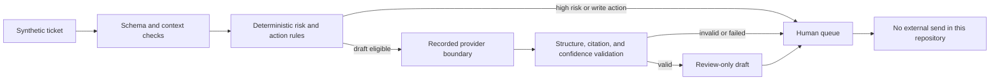

# WISMO and returns readiness proof

> **Independent technical work sample.** Synthetic tickets, recorded provider
> outputs, and a local-only control engine; not client work, not a live Gorgias
> account, and not affiliated with or endorsed by Gorgias or Shopify.

A reviewable proof for a narrow support-automation question: can routine WISMO
and policy questions become grounded draft candidates while exceptions, admin
changes, provider failures, and risky requests stay with a person?

[Interactive evidence page](https://hohuyblon-stack.github.io/gorgias-wismo-returns-readiness-proof/) ·
[Architecture](docs/ARCHITECTURE.md) ·
[Evaluation](docs/EVALUATION.md) ·
[Verification](docs/VERIFICATION.md) ·
[Demo script](docs/DEMO_SCRIPT.md)

## What is implemented

- A deterministic safety router separates draft-eligible, admin-action, and
  escalation intents before a provider is called.
- A recorded, offline provider boundary returns structured draft, citation, and
  confidence fields for synthetic fixtures.
- Drafts are rejected when citations are outside the approved source set,
  confidence is below the declared threshold, output is malformed, or the
  provider fails.
- Missing order context, policy conflicts, high-risk intents, unknown intents,
  and common prompt-injection wording route to a human.
- Every result has `automatic_send_allowed=false`; human approval records review
  state but this repository contains no shopper-send or external-write adapter.
- Twenty committed synthetic scenarios cover ordinary flows and failure paths.
  `evaluation/results.json` is the reproducible output of the offline evaluator.
- The existing page presents 15 curated rows and a 114-second synthetic
  walkthrough; the executable suite adds five safety-focused cases.

## Control flow



The detailed component and trust boundaries are in
[`docs/ARCHITECTURE.md`](docs/ARCHITECTURE.md).

## Quick start

Requires Python 3.9 or newer. No package installation, API key, model account,
or network connection is needed.

```bash
python3 evaluate.py
python3 -m unittest discover -s tests -v
```

Regenerate the committed evaluation evidence:

```bash
python3 evaluate.py --output evaluation/results.json
```

Open `index.html` directly, or serve the page locally:

```bash
python3 -m http.server 8765
```

Then visit `http://127.0.0.1:8765/`.

## What the result means

The committed fixture run records 20 expected-versus-observed routes and zero
automatic sends. A matching route means only that the local control engine
matched the authored expectation for that synthetic input. It is not evidence
of live intent accuracy, draft acceptance, support cost, time saved, SLA impact,
or customer outcomes.

## Security and privacy

- Fixtures contain fictional names, orders, policies, and messages.
- The evaluator performs no network calls and reads no environment secrets.
- Provider exceptions are reduced to a safe failure category rather than copied
  into public output.
- The repository has no refund, cancellation, order-edit, Gorgias, Shopify, or
  message-send credential boundary.

See [`SECURITY.md`](SECURITY.md) and
[`docs/LIMITATIONS.md`](docs/LIMITATIONS.md) before adapting this proof.

## Relevant use

This proof is useful to ecommerce support leads and support-automation partners
evaluating a bounded pre-live readiness sprint: define policy sources, exercise
representative cases, record unsafe false negatives, and keep go-live decisions
with a named reviewer. A production implementation still requires the buyer's
actual policies, lawful access, platform contracts, privacy review, monitoring,
and explicit approval rules.

## Repository map

- `readiness.py` — deterministic routing and review boundary.
- `evaluate.py` — offline fixture runner and report generator.
- `evaluation/scenarios.json` — 20 synthetic evaluation cases.
- `evaluation/results.json` — generated expected-versus-observed evidence.
- `tests/` — behavior, CLI, page-link, and truth-boundary checks.
- `index.html` and `assets/` — public evidence page and captioned walkthrough.
- `docs/` — architecture, evaluation, demo, verification, limitations, and a
  real debugging case study from this hardening pass.

## Limitations

No live provider, retrieval system, Gorgias/Shopify integration, authentication,
durable queue, PII store, operational monitoring, or customer-facing send exists.
The injection check is a small deterministic tripwire, not a comprehensive
prompt-injection defense. See [`docs/LIMITATIONS.md`](docs/LIMITATIONS.md).
