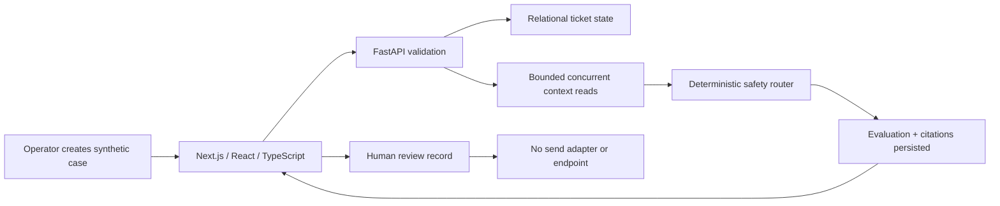

# Support readiness workbench

> **Independent full-stack engineering sample.** The application is real and
> runnable; every ticket, policy, order, and provider result is synthetic or
> recorded. It is not client work, not connected to a live Gorgias or Shopify
> account, and not affiliated with or endorsed by either company.

> **Market-release status: `NOT_MARKET_READY`.** The internal evidence rubric is
> **42.5/100 against a release threshold of 85**, with eight critical gaps. The
> local technical harness passes 11/11 checks, but auth, live contracts,
> governed feedback/analytics/operations, and buyer/user validation remain
> blocking. See the [market-quality gate](docs/MARKET_QUALITY_GATE.md).

A narrow operator workflow for one practical question: can a support case become
a grounded, review-only draft, or must it remain a human-owned action or
escalation?

[Static evidence page](https://hohuyblon-stack.github.io/gorgias-wismo-returns-readiness-proof/) ·
[Architecture](docs/ARCHITECTURE.md) ·
[Evaluation](docs/EVALUATION.md) ·
[Verification](docs/VERIFICATION.md) ·
[Market-quality gate](docs/MARKET_QUALITY_GATE.md) ·
[Demo script](docs/DEMO_SCRIPT.md) ·
[Limitations](docs/LIMITATIONS.md)

## Operator, bottleneck, and scope

**WISMO** means “Where is my order?” The intended reviewer is an ecommerce
Head of Support/CX, support-operations lead, or engineer evaluating a safe first
automation slice. The manual bottleneck is not typing a reply: it is collecting
order and policy context, deciding whether that evidence is sufficient, routing
exceptions consistently, and leaving a human-owned record before any action.

This sample supports synthetic WISMO and ordinary return-request intake,
recorded order/policy context, grounded draft-versus-escalation decisions, and
persisted approval or rejection. Missing context, policy conflicts, low
confidence, prompt injection, provider failure, chargeback/dispute language,
damaged/lost-item exceptions, refund/cancellation/address changes, and every
external send or order mutation remain human-only or out of scope.

## What is real, and what is a fixture

| Boundary | Implemented evidence | Honest limit |
|---|---|---|
| Browser workflow | Next.js/React interface in strict TypeScript with intake, queue, decision, loading, empty, error, mobile, and review states | Local workbench; no customer-facing deployment |
| API | FastAPI request/response validation, bounded pagination, OpenAPI, health/readiness, metrics, explicit conflicts, and API tests | No authentication or public multi-tenant service |
| Relational state | SQLAlchemy ticket/evaluation/citation model, constraints, indexes, Alembic migration, async SQLite test path, and PostgreSQL Docker path exercised in disposable CI | No production data distribution, backup/restore, concurrency or managed-database evidence |
| Async work | Two independent context reads start concurrently under one timeout and cancellation boundary | Deterministic local adapter with recorded delay; no live network/provider throughput claim |
| AI/provider control | Structured recorded output, source allowlist, confidence gate, timeout/failure routing, prompt-injection tripwire, and 20 fixtures | No live model, retrieval system, latency/cost result, or accuracy claim |
| Human oversight | Approval/rejection is persisted; `automatic_send_allowed` is constrained false and the application exposes no send endpoint or button | Approval records readiness only; it cannot contact a shopper or mutate an order |
| Delivery | Locked Python/Node dependencies, backend/frontend/E2E tests, production frontend build, least-privilege CI, Docker files, and runbooks | No AWS account, production SLO, traffic, customer outcome, or paid infrastructure |
| Quality gate | One command runs 11 local technical checks, verifies the fingerprint-checked evidence policy, binds observations to the product-tree digest, and derives criterion status from current checks and sanitized observation receipts | Local technical gate passes; the internal rubric is 42.5/100 against threshold 85 and the verdict remains `NOT_MARKET_READY`. Repository-local automation cannot issue a final market pass |

Synthetic data is not used to make the software look deployed. It is used so the
real API, database, UI, failure paths, and tests can be reviewed without exposing
customer data or requiring paid production accounts.

## Operator journey



The transaction, async, provider, and trust boundaries are detailed in
[`docs/ARCHITECTURE.md`](docs/ARCHITECTURE.md).

## Quick start

Requires Python 3.11–3.14, [uv](https://docs.astral.sh/uv/), Node.js 20.9 or
newer, and npm. The default database is a local SQLite file under ignored
`.state/`; no API key or model account is required.

Install the locked dependencies and migrate the database:

```bash
uv sync --python 3.13 --frozen
uv run --python 3.13 python -m apps.api.app.migrations

cd apps/web
npm ci
cd ../..
```

Start the API from the repository root:

```bash
AUTO_CREATE_SCHEMA=false \
uv run --python 3.13 uvicorn apps.api.app.main:app \
  --host 127.0.0.1 --port 8000
```

In another terminal, start the web application:

```bash
cd apps/web
NEXT_PUBLIC_API_BASE_URL=http://127.0.0.1:8000 \
npm run dev -- --hostname 127.0.0.1 --port 3000
```

Open `http://127.0.0.1:3000`. API documentation is available locally at
`http://127.0.0.1:8000/docs`.

The Docker Compose path uses PostgreSQL and production containers. The draft-PR
smoke job builds the stack, runs the migration, checks health, and exercises a
create/evaluate/metrics path. This is disposable CI evidence, not evidence that
the branch was operated in a cloud or production account:

```bash
docker compose up --build
```

## Verification

Run from the repository root unless a command changes directory:

```bash
# Original deterministic control/evidence contracts
python3 -m unittest discover -s tests -v
python3 evaluate.py --output /tmp/evaluation-results.json
diff -u evaluation/results.json /tmp/evaluation-results.json

# FastAPI, async, migration, SQL, and backend behavior
uv run --python 3.13 pytest -q apps/api/tests

# Strict TypeScript, component behavior, production build, and dependency audit
cd apps/web
npm run typecheck
npm test
npm run build
npm audit --audit-level=high

# Actual browser-to-API-to-database flow
npx playwright install chromium
npm run test:e2e
```

See [`docs/VERIFICATION.md`](docs/VERIFICATION.md) for benchmark, query-plan,
Docker, security-scan, market-quality, and result-boundary details.

## Failure paths visible in the workbench

- malformed API input is rejected with typed validation errors;
- repeated external IDs return an explicit conflict;
- missing order context, policy conflicts, risky/admin intents, unapproved
  citations, low confidence, injection wording, malformed provider output, and
  provider timeout all avoid the review-only draft path;
- API load failure produces a retryable browser error state;
- empty, loading, pending, evaluated, escalation, approval, and rejection states
  remain explicit;
- every evaluation stores zero automatic sends by schema constraint and API
  behavior.

## Repository map

- `apps/web/` — Next.js/React/TypeScript operator workbench, component tests,
  production build, and real full-stack Playwright flow.
- `apps/api/app/` — FastAPI contract, async provider boundary, domain service,
  relational models, metrics, and human-review state.
- `apps/api/migrations/` — versioned relational schema.
- `apps/api/tests/` — API, async-concurrency, migration, metrics, and data tests.
- `readiness.py` — deterministic support-safety and review engine.
- `evaluate.py` and `evaluation/` — 20-case offline regression evidence.
- `index.html` and `assets/` — original static evidence page and walkthrough.
- `docs/` — architecture, performance/SQL evidence, demo, verification,
  limitations, security, deployment, and debugging decisions.

## Relevant use

This proof supports a bounded **Support Automation Readiness Sprint**: map
approved sources, exercise representative routes and failures, name human owners,
and define a safe first implementation slice. A real engagement still requires
the buyer's actual policies, lawful access, privacy review, provider/platform
contracts, measurement plan, and explicit authorization for every external
action.

## Limitations

There is no live LLM, retrieval system, Gorgias/Shopify/carrier integration,
customer identity, authentication, distributed worker, production observability,
AWS deployment, SLO, production benchmark, or business outcome. The local async
and SQL evidence is reproducible engineering evidence, not a scale claim. Read
[`docs/LIMITATIONS.md`](docs/LIMITATIONS.md) before adapting the code.
