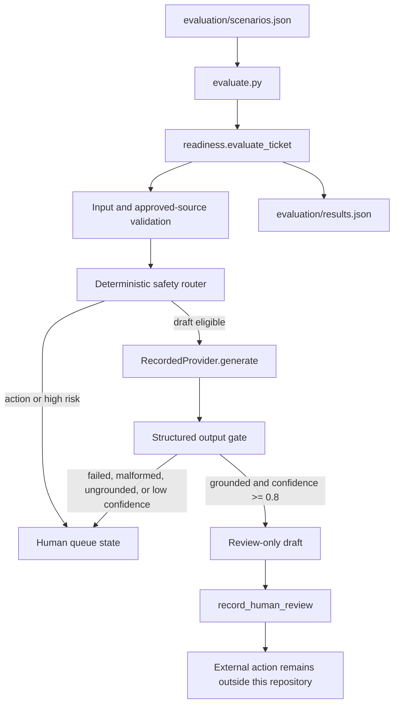

# Architecture

## Purpose

The repository proves a control boundary, not an autonomous support agent. Its
job is to make routing and review behavior inspectable with synthetic inputs.

## Components

### Input fixture

Each scenario names a synthetic ticket, expected route, approved source IDs,
and—only for draft-eligible cases—a recorded provider result or timeout. No
scenario contains a real shopper, order, policy export, or platform credential.

### Deterministic router

`readiness.py` validates shape and context before the provider boundary. Admin
write intents and discretionary/high-risk intents never call the provider.
Missing WISMO context, policy conflicts, unsupported intents, and the small
prompt-injection tripwire fail closed to escalation.

### Provider boundary

`RecordedProvider` is deterministic and offline. It models the contract a live
provider adapter would need to satisfy: a non-empty draft, a list of cited source
IDs, and a numeric confidence. The control engine catches provider failures and
does not copy exception content into the public result.

### Output gate

The gate rejects citations outside the ticket's approved source set and results
below the explicit `0.8` fixture threshold. Passing output becomes a draft for
review, never a shopper-facing message.

### Human review

`record_human_review` records approval or rejection. Approval may mark a draft
ready for a separately authorized human send, but the engine continues to expose
`automatic_send_allowed=false` and has no external adapter.

## Tradeoffs

- Standard-library Python keeps the proof reproducible and CI offline.
- Explicit intent sets make the safety policy easy to inspect but are not a
  substitute for a maintained production taxonomy.
- Recorded outputs prove control behavior, not model quality.
- The public page remains a self-contained static artifact; the evaluator is a
  separate executable evidence path rather than a cosmetic UI backend.
